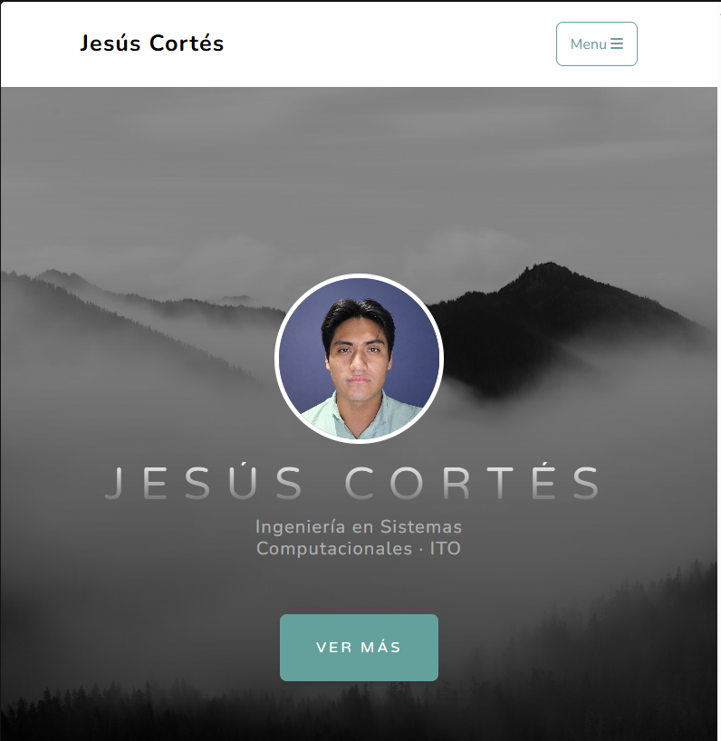
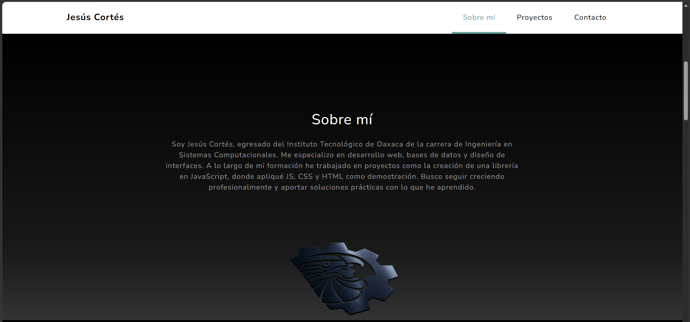
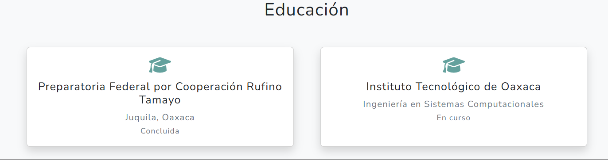
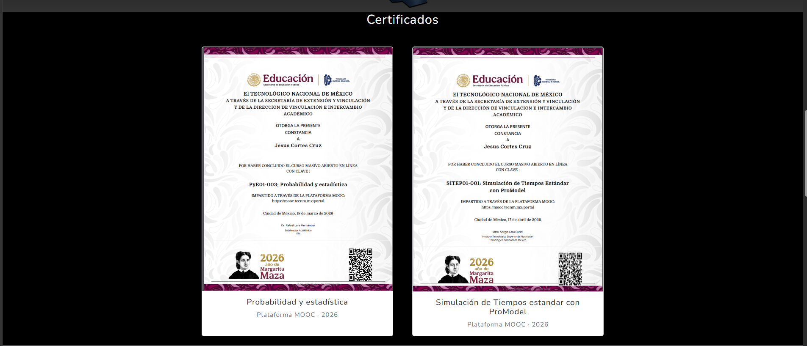
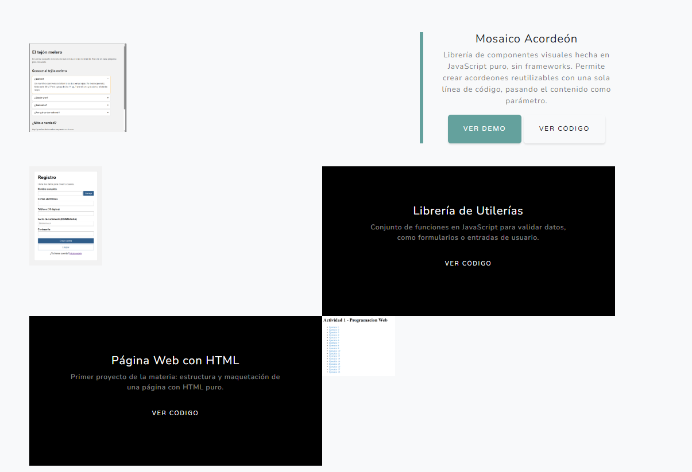
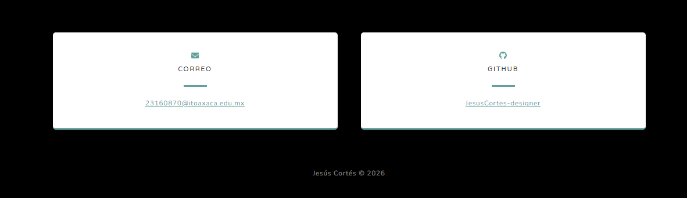

<p align="center">
  <b>TECNOLÓGICO NACIONAL DE MÉXICO</b><br>
  <b>INSTITUTO TECNOLÓGICO DE OAXACA</b>
</p>

<p align="center">
  Carrera: Ingeniería en Sistemas Computacionales<br>
  Materia: Programación Web<br>
  Docente: Adelina Martínez<br>
  Alumno: Cortés Cruz Jesús<br>
  Número de control: 23160870
</p>

---

# Jesús Cortés - Portafolio Personal

Portafolio web personal hecho con Bootstrap, a partir de la plantilla **Grayscale** de Start Bootstrap. Muestra una presentación personal, educación, certificados, proyectos realizados durante la carrera y los datos de contacto.

## Descripción del proyecto

**Framework CSS:** Bootstrap 5, incluido dentro del CSS de la plantilla (no se agregó por separado).

**Plantilla usada:** [Grayscale](https://startbootstrap.com/theme/grayscale), de Start Bootstrap. Es una plantilla gratuita y de código abierto, pensada para páginas de una sola sección (one-page), con un estilo en blanco y negro.

**Link de descarga de la plantilla:** https://startbootstrap.com/theme/grayscale

### Secciones del portafolio

| Sección | Qué contiene |
|---|---|
| **Inicio (Masthead)** | Foto de perfil en círculo, nombre completo y carrera, con un botón que lleva a la sección "Sobre mí" |
| **Sobre mí** | Breve presentación personal: carrera, especialidad y experiencia en proyectos. Incluye el logo del Tecnológico Nacional de México |
| **Educación** | Dos tarjetas con la trayectoria académica: la preparatoria de origen y los estudios actuales en el ITO |
| **Certificados** | Dos tarjetas con los certificados de cursos MOOC completados, cada una con imagen, nombre del curso y plataforma |
| **Proyectos** | Tres proyectos de la carrera, cada uno con una captura, descripción y enlace a su repositorio en GitHub |
| **Contacto** | Correo institucional y usuario de GitHub, cada uno en una tarjeta |
| **Pie de página** | Derechos de autor y año |

## Proceso de creación

1. **Descarga de la plantilla.** Se descargó la plantilla Grayscale desde Start Bootstrap, que incluye el HTML base, el CSS (`portafolio.css`) y el JS (`portafolio.js`) de Bootstrap 5.

2. **Limpieza del contenido de ejemplo.** La plantilla trae texto y proyectos ficticios ("Shoreline", "Misty", "Mountains"), una dirección y teléfono inventados, y un formulario de suscripción que requiere un token de pago. Se eliminó todo ese contenido porque no correspondía a información real.

3. **Sección "Sobre mí".** Se reemplazó el texto genérico por una presentación personal con la carrera, especialidad y experiencia en proyectos.

4. **Logo del Tecnológico.** Se cambió la imagen del iPad que traía la plantilla por el logo del Tecnológico Nacional de México, inclinado y con sombra, para mantener el mismo efecto visual que tenía la imagen original.

5. **Foto de perfil.** Se agregó una fotografía personal en formato circular en la parte superior del encabezado, usando la clase `rounded-circle` de Bootstrap.

6. **Sección de educación.** Se creó una sección nueva, entre "Sobre mí" y "Certificados", con tarjetas (`card`) de Bootstrap para mostrar la trayectoria académica, en orden cronológico.

7. **Sección de certificados.** Se creó otra sección nueva, antes de "Proyectos", con tarjetas de Bootstrap para mostrar los certificados de cursos MOOC.

8. **Sección de proyectos.** Se reemplazaron los tres proyectos de ejemplo por proyectos reales del autor, cada uno con su captura de pantalla y un enlace a su repositorio en GitHub.

9. **Sección de contacto.** Se quitó la dirección y el teléfono de ejemplo, y se dejaron solo el correo institucional y el perfil de GitHub, que sí son reales.

10. **Corrección de detalles.** Se revisó que todos los enlaces funcionaran, se corrigió un error en el enlace del correo (`mailto`) y se quitó un ícono que generaba un error 404 en la consola.

## Capturas de pantalla

**Inicio:**



**Sobre mí:**



**Educación:**



**Certificados:**



**Proyectos:**



**Contacto:**



## Estructura del proyecto

## Estructura del proyecto

```
├── index.html
├── README.md
├── css/
│   └── portafolio.css
├── js/
│   └── portafolio.js
└── img/
    ├── foto-perfil.png
    ├── logo.png
    ├── inicio.png
    ├── sobremi.png
    ├── educacion.png
    ├── certificados.png
    ├── certificadoPro.png
    ├── certificadoSim.png
    ├── proyectos.png
    ├── contactos.png
    ├── image.png
    ├── image2.png
    └── image3.png
```